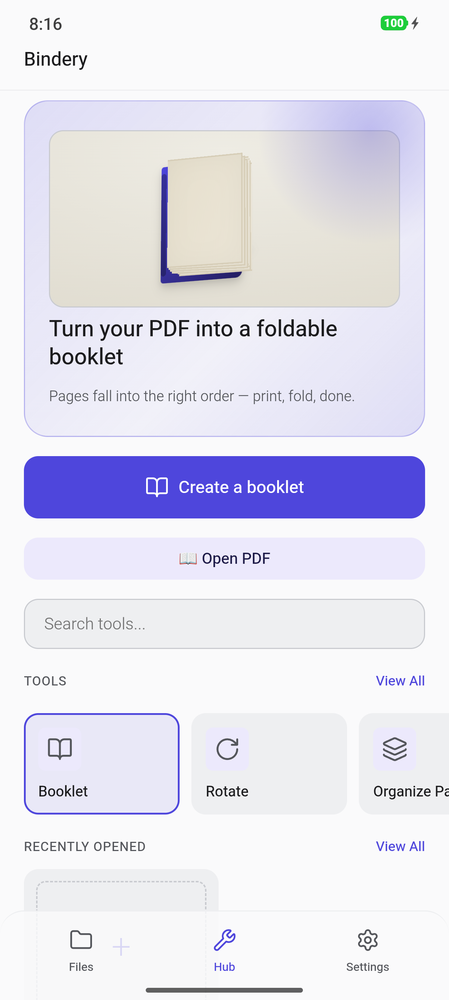
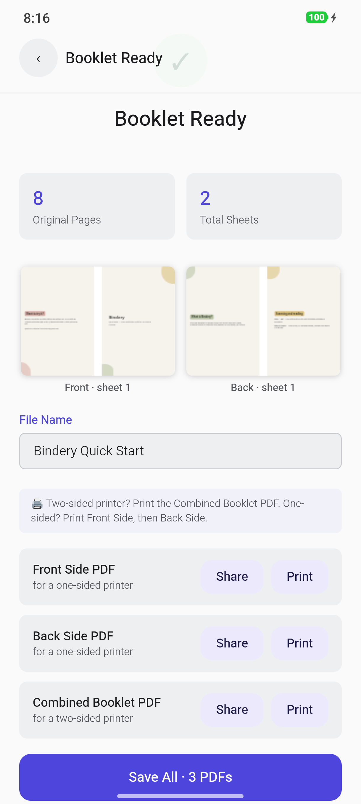
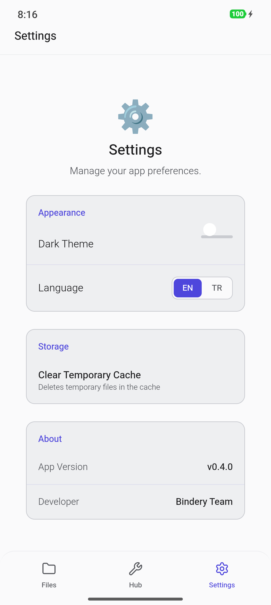
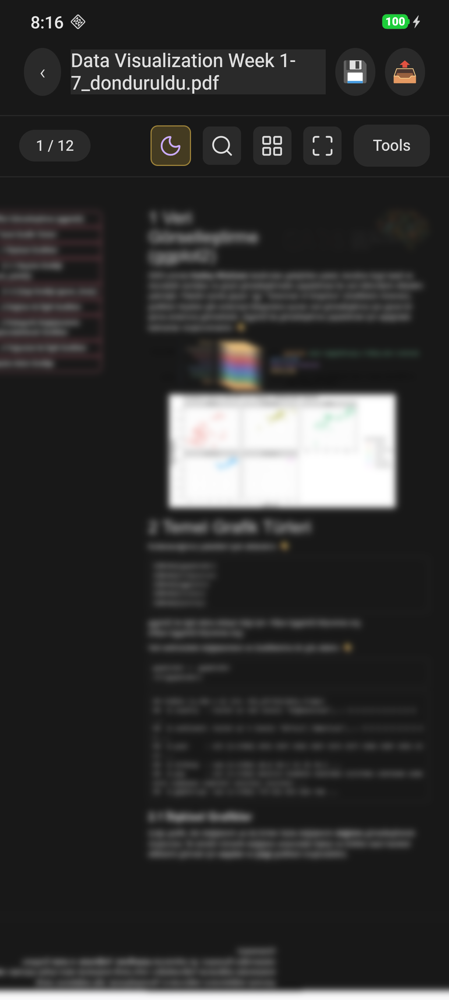

# Bindery: All-in-One PDF Tools

**Language / Dil:**
- [English](#-english)
- [Türkçe](#-türkçe)

---

<a name="-english"></a>
## English

Bindery is a privacy-focused PDF toolkit for Android. Every core tool — booklet making, merging, page management, watermarking — runs entirely on your device.

### Why Privacy-Focused?

Every operation on your existing files — merging, page management, conversion, booklet making — happens **entirely locally, on your device's CPU**. Your files never leave your device; nothing is uploaded to a server, and nothing is shared with any analytics or tracking service. The one feature that touches the network is optional: importing a PDF from a URL you provide. Everything else stays local — and since Bindery is open source, you can verify that yourself.

### Features

- **Booklet Maker** — Turns a PDF into a foldable booklet layout
  - Multi-signature imposition for thick documents (8/16/32-page or auto signatures, per-signature creep)
  - Paper size selection (A4 / Letter / A5 / A3 / source size), duplex flip-edge (short/long) support
  - Right-to-left (RTL) binding, separate cover export for heavier stock
  - Blank page insertion at chosen positions, printed instructions sheet with a reading-order check
  - Interactive "what is a signature?" explainer with a live 3D folding animation
- **PDF Merge** — Combines multiple PDFs into a single file
- **Page Management** — Add, delete, and reorder pages
- **Page Rotation**
- **Page Numbering**
- **Watermarking**
- **Image-to-PDF + Perspective Correction** — Convert photos to clean PDF with automatic perspective correction
- **Built-in PDF Reader**:
  - Night mode (canvas-level smart color inversion)
  - Text selection / copying
  - In-document text search
  - Resume from last-read page (recents resume-to-page)
- **Local File Folders** — Sorting in the Files tab and opening tools directly from a file

### Screenshots

| Home | Booklet Result |
|---|---|
|  |  |

| Settings | Reader (Night Mode) |
|---|---|
|  |  |

### Development & Build

```bash
npm run test && npm run build
npx cap sync
npx cap run android
```

> **Note:** Ensure `$ANDROID_HOME` and `$JAVA_HOME` (Java 21) are configured in your environment, or simply open `android/` in Android Studio.

### License

This project is licensed under **GPL-3.0**. See [`LICENSE`](LICENSE) for the full text and [`LICENSING.md`](LICENSING.md) for the rationale behind this license choice.

---

<a name="-türkçe"></a>
## Türkçe

Bindery, Android için gizlilik odaklı bir PDF araç setidir. Kitapçık oluşturma, birleştirme, sayfa düzenleme, filigran gibi tüm çekirdek araçlar tamamen cihazınızda çalışır.

### Neden Gizlilik Odaklı?

Var olan dosyalarınız üzerindeki tüm işlemler — birleştirme, sayfa düzenleme, dönüştürme, kitapçık oluşturma — **cihazınızın CPU'sunda, tamamen yerel olarak** gerçekleşir. Dosyalarınız hiçbir zaman cihazınızdan çıkmaz; hiçbir sunucuya yüklenmez, hiçbir analitik/izleme servisiyle paylaşılmaz. Ağa dokunan tek özellik opsiyoneldir: verdiğiniz bir URL'den PDF içe aktarma. Geri kalan her şey yerelde kalır — ve Bindery açık kaynak olduğu için bunu kendiniz doğrulayabilirsiniz.

### Özellikler

- **Kitapçık (Booklet) Oluşturucu** — PDF'i katlanabilir kitapçık düzenine getirir
  - Kalın belgeler için çoklu imza dizgisi (8/16/32 sayfalık veya otomatik imzalar, imza başına creep)
  - Kağıt boyutu seçimi (A4 / Letter / A5 / A3 / kaynak boyutu), duplex çevirme kenarı (kısa/uzun) desteği
  - Sağdan (RTL) ciltleme, kalın kağıt için ayrı kapak çıktısı
  - İstenen konuma boş sayfa ekleme, okuma sırası kontrolü içeren baskı talimat sayfası
  - Canlı 3B katlama animasyonuyla interaktif "imza nedir?" açıklaması
- **PDF Birleştir** — Birden fazla PDF'i tek dosyada birleştirir
- **Sayfa Yönetimi** — Sayfa ekleme, silme, yeniden sıralama
- **Sayfa Döndürme**
- **Sayfa Numarası Ekleme**
- **Filigran (Watermark) Ekleme**
- **Görselden PDF + Perspektif Düzeltme** — Fotoğraflardan PDF oluşturma, otomatik perspektif düzeltme
- **Dahili PDF Okuyucu**:
  - Gece modu (canvas seviyesinde akıllı renk tersine çevirme)
  - Metin seçme / kopyalama
  - Belge içi metin arama
  - Son okunan sayfadan devam etme (recents resume-to-page)
- **Yerel Dosya Klasörleri** — Files sekmesinde sıralama ve dosyadan doğrudan araç açma

### Ekran Görüntüleri

| Ana Ekran | Kitapçık Sonuç Ekranı |
|---|---|
|  |  |

| Ayarlar | Okuyucu (Gece Modu) |
|---|---|
|  |  |

### Geliştirme & Derleme

```bash
npm run test && npm run build
npx cap sync
npx cap run android
```

> **Not:** Ortamınızda `$ANDROID_HOME` ve `$JAVA_HOME` (Java 21) değişkenlerinin tanımlı olduğundan emin olun veya doğrudan Android Studio ile `android/` klasörünü açın.

### Lisans

Bu proje **GPL-3.0** ile lisanslanmıştır. Tam metin için [`LICENSE`](LICENSE) dosyasına, lisans seçim gerekçesi için [`LICENSING.md`](LICENSING.md) dosyasına bakın.
